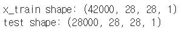
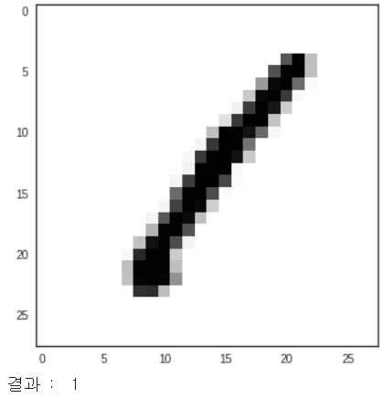

아래 소스코드는 kaggle 커널 [Introduction to CNN Keras - 0.997 (top 6%) - Yassine Ghouzam](https://www.kaggle.com/yassineghouzam/introduction-to-cnn-keras-0-997-top-6) 내용입니다.

## Digit Reconizer

### 패키지 주입

```python
import pandas as pd
import numpy as np
import matplotlib.pyplot as plt
import matplotlib.image as mpimg
import seaborn as sns
%matplotlib inline

np.random.seed(2)

from sklearn.model_selection import train_test_split
from sklearn.metrics import confusion_matrix
import itertools

from keras.utils.np_utils import to_categorical # convert to one-hot-encoding
from keras.models import Sequential
from keras.layers import Dense, Dropout, Flatten, Conv2D, MaxPool2D
from keras.optimizers import RMSprop
from keras.preprocessing.image import ImageDataGenerator
from keras.callbacks import ReduceLROnPlateau

sns.set(style='white', context='notebook', palette='deep')
```

&nbsp;

### 데이터 불러오기

```python
train = pd.read_csv("../input/mnist/train.csv")
test = pd.read_csv("../input/mnist/test.csv")
```

캐글에서 제공하는 데이터를 불러온다.

`train` 은 모델 `학습(train) / 검증(validation) 용`으로 쓰이고,
`test` 는 `제출(submission) 용` 이다.

&nbsp;

### 레이블 분류

```python
x_train = train.drop("label",1)

y_train = train["label"]
```

train 데이터에는 레이블(label) 이 추가되어 있다.

`x_train` => 입력 데이터

`y_train` => 결과

으로 나누었다.

&nbsp;

### label 카테고리 확인

```python
sns.countplot(y_train)
```


사랑스러울 정도로 고르게 들어가 있다.

&nbsp;

### null 데이터 확인

```python
print(x_train.isnull().any().describe())
print("\n\n")
print(test.isnull().any().describe())
```


&nbsp;

### ?

```python
x_train = x_train/255.0
test = test/255.0
```

각 픽셀은 `0(흰색) ~ 255(검정색)` 으로 분포되어 있다.

이 것을 `0 ~ 1` 사이 값으로 바꿔준다.

why?

&nbsp;

### reshape

```python
x_train = x_train.values.reshape(-1,28,28,1)
test = test.values.reshape(-1,28,28,1)
```

현제 픽셀 784(28x28)개가 일열로 줄 서 있다.
어떤 픽셀의 바로 밑 픽셀이 28칸이나 뒤에 있다.
이런 식으로는 분석이 어렵겠으니, 28x28 로 데이터를 reshape 한다.

**`-1`** : 데이터 갯수 (-1개가 아니라, 알아서 맞춰준다.)
**`28`** : 세로
**`28`** : 가로
**`1`** : 1개. 흑백이므로 컬러 정보가 1개면 된다. RGB로 표현된 색의 경우에는 3개의 정보가 들어오기 때문에 ,`3`을 사용함.)

색을 표현할 때 Red(0~255), Green(0~255), Blue(0~255) 값으로 표현한다.
여기서는 흑백사진이므로 0~255 한개만 있으면 된다.

&nbsp;

```python
print('x_train shape:', x_train.shape)
print('test shape:', test.shape)
```



&nbsp;

```python
plt.imshow(x_train[0][:,:,0])
plt.show()

print('결과 : ',y_train[0])
```



&nbsp;

### 원-핫-인코딩

```python
y_train = to_categorical(y_train, num_classes = 10)
```

**`y_train`** 값들은 현재 0~9 값으로 되어 있다. 이 값을 인코딩 해준다.

예를 들어, 위의 `y_train[0]` 는 `[0,1,0,0,0,0,0,0,0]` 로 변환된다.
( 1 -> [0,1,0,0,0,0,0,0,0])

&nbsp;

### 검증 데이터 만들기

```python
random_seed = 777
x_train, x_val, y_train, y_val = train_test_split(x_train, y_train, test_size = 0.1, random_state=random_seed)
```

기존의 **`x_train`** 데이터를 **`test_size`** 만큼 **`x_val`** 에 떼어준다.

**`x_val`** 는 학습에 영향을 미치지 않는다.

**`random_seed`** : 말그대로 랜덤 시드 이다. 이 값을 `776`으로 바꾸면 **`x_val`** 의 데이터는 `777` 과는 다르게 나뉠 것이다.

validation에 대해서는 [여기]() 잘 정리되어있다.

&nbsp;

모델을 만들기 위한 데이터 가공이 끝났다.

`x_train` : 학습시키기 위한 데이터.

`y_train` : 학습시키기 위한 데이터. x_train 의 이상적인 결과

`x_val`,`y_val` : 학습모델을 평가하기 위한 데이터. 모델에 `x_val`을 넣어서 `y_val` 와 비교하는 것을 반복하여 최적의 파라미터를 찾음

---

### CNN model

[CNN Layer Talk - 김태영님 블로그](https://tykimos.github.io/2017/01/27/CNN_Layer_Talk/)에 너무 잘 설명 되어있다.

**CNN 모델 (아래 코드와 약간 차이있음)**


이미지 출처 : http://adventuresinmachinelearning.com/keras-tutorial-cnn-11-lines/

```python
model = Sequential()

model.add(Conv2D(filters = 32, kernel_size = (5,5),padding = 'Same',
                 activation ='relu', input_shape = (28,28,1), strides=(1, 1)))
model.add(Conv2D(filters = 32, kernel_size = (5,5),padding = 'Same',
                 activation ='relu'))

model.add(MaxPool2D(pool_size=(2,2)))
model.add(Dropout(0.25))

model.add(Conv2D(filters = 64, kernel_size = (3,3),padding = 'Same',
                 activation ='relu'))
model.add(Conv2D(filters = 64, kernel_size = (3,3),padding = 'Same',
                 activation ='relu'))

model.add(MaxPool2D(pool_size=(2,2), strides=(2,2)))
model.add(Dropout(0.25))

model.add(Flatten())
model.add(Dense(256, activation = "relu"))
model.add(Dropout(0.5))
model.add(Dense(10, activation = "softmax"))
```

&nbsp;

**`model = Sequential()`**

모델의 타입정의.

연속적인(Sequential) 층을 차곡차곡 쌓을 예정

&nbsp;

**`model.add(Conv2D(filters = 32, kernel_size = (5,5),padding = 'Same',
                 activation ='relu', input_shape = (28,28,1)))
`**

`Conv2D` : 2D convolutional layer

`filters = 32` : kernel_size(5x5) 크기의 필터 32개 만들고, 이 필터를 적용시킨 28x28x1 output 32개가 만들어짐.

내가 찍은 사진에 32개의 필터를 각각 덮어 씌운 결과 라고 보면 될듯

`kernel_size = (5,5)` : 필터 사이즈는 5x5

`padding = 'Same'` : 입력이미지와 출력이미지 사이즈 동일. 여기서 패
딩은 2로 주면 사이즈 같겠네.. (Same / Valid)

`Same` : 입력 이미지에 <u>경계를 학습시키는 효과</u>가 있음.

`activation='relu'` : 활성화 함수는 relu (relu, softmax, linear, sigmoid)

`input_shape = (28,28,1)` : 첫 번째 레이어에는 입력 데이터 shape를 명시해 주어야 함

`strides=(1, 1)` : 스트라이드가 1이다. -> 필터 적용 윈도우가 한칸씩 이동 (밑바닥부터 시작하는 딥러닝 p233)

&nbsp;

**`model.add(MaxPool2D(pool_size=(2,2)))`**

`pooling` : 가로,세로 방향의 공간을 줄이는 연산

`pool_size=(2,2)` : 2x2 영역을 1x1로 나타냄

`MaxPool2D` : 해당 영역에서 가장 큰 원소를 선택 -> 사소한 변화가 영향을 미치지 않게 함.

(`average pooling` 도 있으나, 이미지 인식에서는 주로 `max pooling`을 사용함)

- 4x4 를 2x2풀링으로 스트라이드는 1일 때의 결과 크기 : 3x3
- 4x4 를 2x2풀링으로 스트라이드는 2일 때의 결과 크기 : 2x2

&nbsp;

**`model.add(Dropout(0.25))`**

`Dropout` : 오버피팅을 줄이기 위한 기법 중 하나.


`Dropout` 에 관해서는 [Dropout  - 라온피플 머신러닝 아카데미](http://blog.naver.com/PostView.nhn?blogId=laonple&logNo=220818841217&categoryNo=0&parentCategoryNo=0&viewDate=&currentPage=1&postListTopCurrentPage=1&from=postView)에 친절하게 설명되어 있다.

&nbsp;

**`model.add(Flatten())`**

1차원 데이터로 바꿔줌. 뉴런 3164개 (7x7x64)

&nbsp;

**`model.add(Dense(256, activation = "relu"))`**

`Dense` : dense layer. 위에서는 convolution layer 였음.

출력 뉴런 256개, 활성화함수는 relu

&nbsp;

**`model.add(Dense(10, activation = "softmax"))`**

`10` : 출력 뉴런 10개. 0~9 숫자 classifier 위한 뉴런 10개(밑바닥부터 시작하는 딥러닝 p95)

`softmax` : loss함수 구하기 위함 (밑바닥부터 시작하는 딥러닝 p94)

&nbsp;
&nbsp;

**위 model에 dropout을 모두 생략 해 보았다.**


오버피팅이 일어난다.

&nbsp;

### compile

```python
# Compile the model
model.compile( loss = "categorical_crossentropy",
               optimizer = RMSprop(lr=0.001, rho=0.9, epsilon=1e-08, decay=0.0) ,
               metrics=["accuracy"]
             )
```

**`loss`** : 손실 함수 ( categorical_crossentropy / )

**`optimizer`** : (SGD, Momentum, AdaGrad, Adam 등)

> 신경망을 학습할 때 정확도를 지표로 삼아서는 안 된다. 이유는 밑바닥부터 배우는 딥러닝 p119

&nbsp;

### generator

```python
datagen = ImageDataGenerator(
        featurewise_center=False,  # set input mean to 0 over the dataset
        samplewise_center=False,  # set each sample mean to 0
        featurewise_std_normalization=False,  # divide inputs by std of the dataset
        samplewise_std_normalization=False,  # divide each input by its std
        zca_whitening=False,  # apply ZCA whitening
        rotation_range=10,  # randomly rotate images in the range (degrees, 0 to 180)
        zoom_range = 0.1, # Randomly zoom image
        width_shift_range=0.1,  # randomly shift images horizontally (fraction of total width)
        height_shift_range=0.1,  # randomly shift images vertically (fraction of total height)
        horizontal_flip=False,  # randomly flip images
        vertical_flip=False)  # randomly flip images


datagen.fit(x_train)
```

이미지를 조금씩 수정한다.

각도를 돌린다거나, 확대시킨다거나, 통째로 움직인다거나, 좌우반전 등이 가능하다.

&nbsp;

### 학습

```python
epochs = 30
batch_size = 86

learning_rate_reduction = ReduceLROnPlateau(moxnitor='val_acc',
                                            patience=3,
                                            verbose=1,
                                            factor=0.5,
                                            min_lr=0.00001)

# Fit the model
history = model.fit_generator( datagen.flow(x_train,y_train, batch_size=batch_size),
                               epochs = epochs,
                               validation_data = (x_val,y_val),
                               verbose = 2, steps_per_epoch=x_train.shape[0] // batch_size,
                               callbacks=[learning_rate_reduction])
```

**`epoch`** : 모든 train 데이터를 순방향 / 역방향 수행

**'batch_size'** : 순방향 / 역방향을 1번 수행할 때 1개 씩 수행하는 것이 batch_size 만큼 묶어서 수행한다.

(train 데이터가 1000개, batch_size가 500 이라면 1epoch 수행하기 위해서는 2번의 iterations(one iteration = one foward pass + one backward pass)가 일어난다.)
[What is batch size in neural network?](https://stats.stackexchange.com/questions/153531/what-is-batch-size-in-neural-network) 참고


&nbsp;

### confusion matrix

```python
def plot_confusion_matrix(cm, classes,
                          normalize=False,
                          title='Confusion matrix',
                          cmap=plt.cm.Blues):
    """
    This function prints and plots the confusion matrix.
    Normalization can be applied by setting `normalize=True`.
    """
    plt.imshow(cm, interpolation='nearest', cmap=cmap)
    plt.title(title)
    plt.colorbar()
    tick_marks = np.arange(len(classes))
    plt.xticks(tick_marks, classes, rotation=45)
    plt.yticks(tick_marks, classes)

    if normalize:
        cm = cm.astype('float') / cm.sum(axis=1)[:, np.newaxis]

    thresh = cm.max() / 2.
    for i, j in itertools.product(range(cm.shape[0]), range(cm.shape[1])):
        plt.text(j, i, cm[i, j],
                 horizontalalignment="center",
                 color="white" if cm[i, j] > thresh else "black")

    plt.tight_layout()
    plt.ylabel('True label')
    plt.xlabel('Predicted label')

# Predict the values from the validation dataset
y_pred = model.predict(x_val)
# Convert predictions classes to one hot vectors
y_pred_classes = np.argmax(y_pred,axis = 1)
# Convert validation observations to one hot vectors
y_true = np.argmax(y_val,axis = 1)
# compute the confusion matrix
confusion_mtx = confusion_matrix(y_true, y_pred_classes)
# plot the confusion matrix
plot_confusion_matrix(confusion_mtx, classes = range(10))
```


특정 숫자를 다르게 인식하는 경우가 있는지 확인할 수 있다.

여기서는 유별나게 꼬이는 숫자는 없는 듯 하다.

&nbsp;

### 틀린것들, 사진좀 봅시다 !

```pyton
# Errors are difference between predicted labels and true labels
errors = (y_pred_classes - y_true != 0)

y_pred_classes_errors = y_pred_classes[errors]
y_pred_errors = y_pred[errors]
y_true_errors = y_true[errors]
x_val_errors = x_val[errors]
z
def display_errors(errors_index,img_errors,pred_errors, obs_errors):
    """ This function shows 6 images with their predicted and real labels"""
    n = 0
    nrows = 2
    ncols = 3
    fig, ax = plt.subplots(nrows,ncols,sharex=True,sharey=True)
    for row in range(nrows):
        for col in range(ncols):
            error = errors_index[n]
            ax[row,col].imshow((img_errors[error]).reshape((28,28)))
            ax[row,col].set_title("Predicted label :{}\nTrue label :{}".format(pred_errors[error],obs_errors[error]))
            n += 1

# Probabilities of the wrong predicted numbers
y_pred_errors_prob = np.max(y_pred_errors,axis = 1)

# Predicted probabilities of the true values in the error set
true_prob_errors = np.diagonal(np.take(y_pred_errors, y_true_errors, axis=1))

# Difference between the probability of the predicted label and the true label
delta_pred_true_errors = y_pred_errors_prob - true_prob_errors

# Sorted list of the delta prob errors
sorted_dela_errors = np.argsort(delta_pred_true_errors)

# Top 6 errors
most_important_errors = sorted_dela_errors[-6:]

# Show the top 6 errors
display_errors(most_important_errors, x_val_errors, y_pred_classes_errors, y_true_errors)
```

왜이렇게 코드가 많은 것이여.. 봐도 모르겠는데ㅠㅠ 이건 다음에 해야쥐


틀릴 법 하다... 나도 못맞추겠다.
