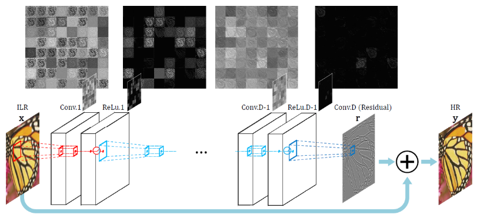
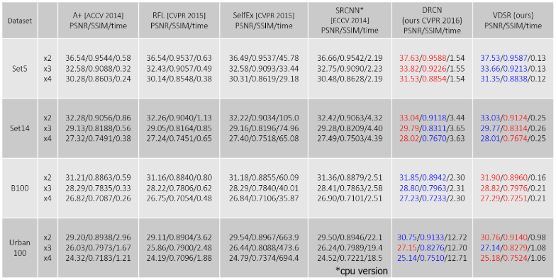
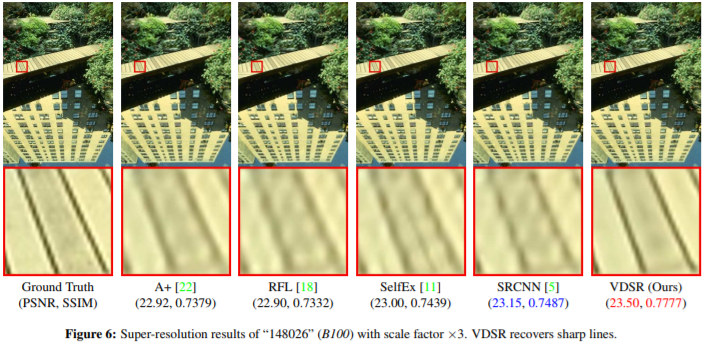
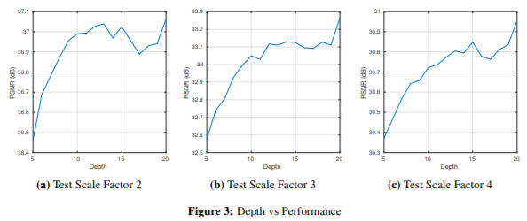
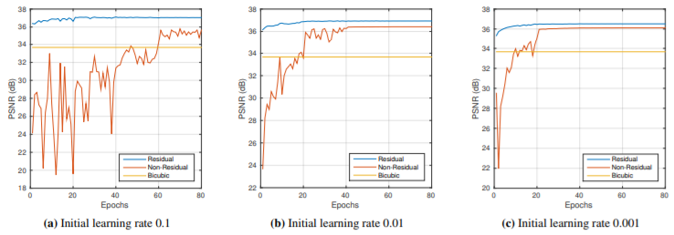

# Accurate Image Super-Resolution using Very Deep Convolutional Networks (VDSR) (2016)

> [video](https://youtu.be/1jGr_OFyfa0?t=20m49s)  
 [paper](https://cv.snu.ac.kr/research/VDSR/VDSR_CVPR2016.pdf)

&nbsp;

|  | SRCNN     |VDSR|
| :------------- | :------------- | :------------- |
| Architecture      | end-to-end learning|end-to-end learning|
|Receptive fields   | 13 x 13  | 41 x 41  |
|Scale factors   | x3  | x2, x3, x4  |
|Learning rate   |  10^-5^ | learning rate decay(10^-2^, 10^-6^)  |
|Depth   | 4 | (Up to) 20 |

&nbsp;

## 핵심 아이디어

VGG 처럼 layer 자체를 `3x3 convolution layer` 20개를 쌓았구요

맨 마지막에 핵심적으로 `Residual`을 넣었어요.

그 말은 이 x 이미지를 그대로 학습하는 것이 아니라 SR의 문제의 특징을 보면은.. 입력 영상과 출력 영상의 형태가 거의 비슷하다는 것이거든요. 그럼 이 두이미지의 차를 구해보면 이렇게 넓은 범위(나비의 노란부분) 에 있어서는 별로 달라지는 부분이 없다는 거죠. 그런 부분들은 거의 0에 가까운 값으로 나타나게 되고, 크게 차이가 나는 경계 부분에서는 높은 값이 나타나기 때문에 이 높게 나타나는 부분들만 잘 학습을 시키면 모델 전체가 훨씬 더 빨리 이루어지겠다 라는 아이디어에서 이 Residual layer를 넣었습니다.

&nbsp;

**Q. ResNet처럼 각 layer마다 Residual을 넣으면 안되나요?**

이 중간 activation되는 결과들 자체가 그렇게 의미가 있을지는 저도 잘 모르겠어요. 그래서 중간에 Residual을 넣으면 직관적으로는 학습이 훨씬 더 빨리 될 것 같기도 한데 그 시도에 대한 결과는 저도 장담을 할 수가 없네요.

&nbsp;

**Q. Residual 하려면 size가 같아야 하는데 지금 사이즈가 같은건가요?**

네 같습니다. (애초에 x와 y의 사이즈를 같게 줌) x가 들어올 때 UpSampling을 한 데이터라서 y와 사이즈는 같습니다.

(유재준님)
DownSampling을 하고 나면 디테일한 structure는 다 깨지잖아요? (x의 디테일한 structure는 깨져 있을 것임.) x의 커다란 structure는 Residual로 그대로 가져가고, Network가 학습해줬으면 하는 부분(r) 은 사라진 디테일한 structure를 잘 학습하자 는 것이 핵심이라...  
x데이터는(y데이터를 DownSampling 후 UpSampling을 한 것) y데이터보다 디테일한 fixel들이 뭉개져 있어요. 그 디테일을 학습시켜서 잘 되는걸로 알고 있거든요..

&nbsp;

3x3 filter를 20개 layer를 쌓아서 41x41의 **receptive field** 를 크게 올렸구요.

**lose function** 은 Residual loss 를 이용해서 학습을 쉽게함

**gradient clipping** 을 이용하여 너무 high한 값으로 튀어나가지 않게끔 계속해서 gradient를 조절하는 테크닉을 썼어요.

종합을 해보면 41x41 size인 input size patch를 키웠구요. 그리고 이걸 뽑을 때 기존 논문에서는 stride를 줘서 데이터셋 자체를 늘렸지만, 여기서는 overlap하지 않았고

mini-bach는 64

...

&nbsp;
&nbsp;

## 실험 결과

경계 부분이 확실히 더 잘 살아나는 것을 보실 수 있어요.

&nbsp;

(depth가 높을수록 성능이 잘나오고요)

&nbsp;

(residual을 썼을 때 빠르게 수렴하는 것을 볼 수 있습니다.)

&nbsp;

## 리뷰의견

SRCNN을 20개의 layer로 확장하고 Residual 사용한 것이 VDSR.

확장 하는것이 확실히 좋음.

edge 부분을 주 타겟으로 학습했기 때문에 학습에 대한 효과가 뛰어난 것을 볼 수가 있습니다.
