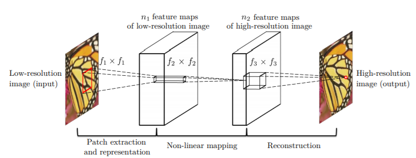
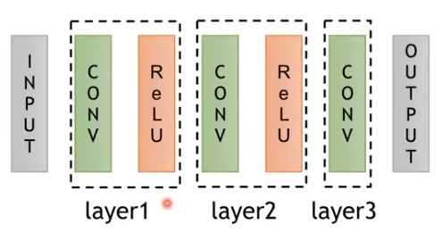
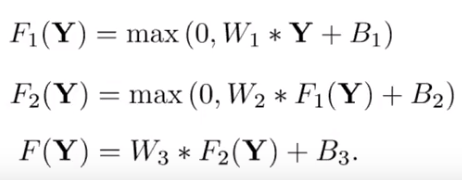
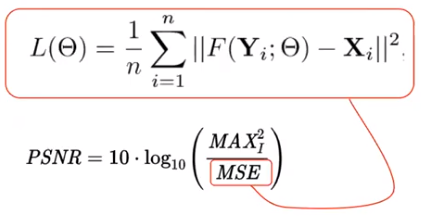
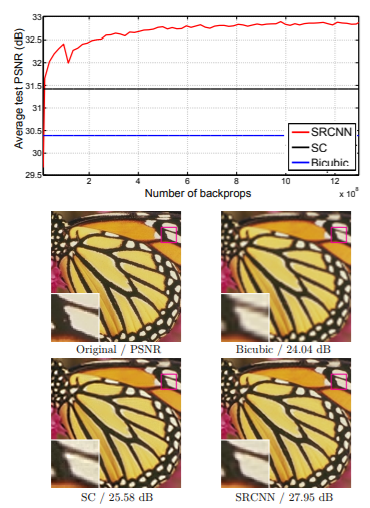
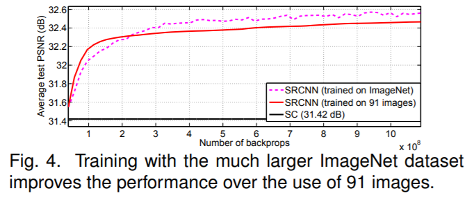
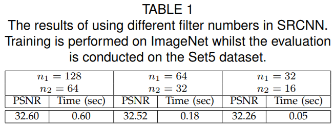
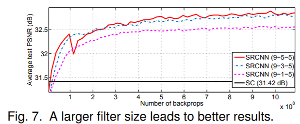
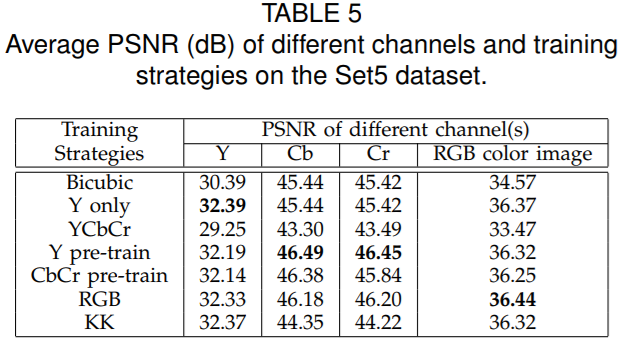

# Image Super-Resolution Using Deep Convolutional Networks

> [Youtube 영상](https://youtu.be/1jGr_OFyfa0)
> [Paper](https://arxiv.org/pdf/1501.00092.pdf)

&nbsp;

**Super-Resolution (SR) 이란 ?**

저해상도 -> 고해상도 로 변환하는 작업
low resolution -> high resolution

&nbsp;

`Single Image Super-Resolution `에는 다양한 솔루션이 존재함 -> 심각한 문제

&nbsp;

해상도를 개선시키는 것은 대상들이 아주 다양합니다.

의료영상, 위성영상, 현미경영상, 천체영상 등 다양한 부분에서 공통적으로 적용될 수가 있습니다.

but, 의료영상의 질병, 위성영상 등에서는 조심스럽게 조심스럽게 다뤄야할 부분입니다.

&nbsp;

### 평가방식

**PSNR**

최대 신호 대 잡음비 (영상 화질 손실정보에 대한 평가)

**SSIM**

밝기, 명암, 구조 를 조합하여 두 영상의 유사도 평가

**MS-SSIM**

다양한 배율에 대해 SSIM 평가

**IFC**

서로 다른 두 확률분포에 대한 의존도 평가

&nbsp;
&nbsp;

## Related Work (이전 연구)

딥러닝 이전의 다양한 연구들 중 2가지

**1. Example-Based 방식**

저해상도와 고해상도의 쌍을 미리 예제로 뽑아놓고 거기에 매칭시키는 방법

데이터셋, 학습모델 구축에 어려운 방식

&nbsp;

**2. Sparse Representation**

CNN을 통해서 만들어지는 Feature vetor extraction과 비슷하게 로우 레졸루션을 어떻게 심플하게 표현을 해서 다시 고해상도 이미지로 만들어낼 수 있을까? 에 대한 방식

&nbsp;
&nbsp;

## CNN for Super-Resolution

**CNN with 3-layers**

네트워크가 엄청 단순함.

AlexNet보다도 단순함.

이 논문에 컨트리뷰션이 있다면 SR에 처음으로 딥러닝을 적용했다. 정도의 의미가 있지 않을까 싶습니다.

&nbsp;

**다이어그램**

&nbsp;

**수식**

input : Y
output : F(Y)

컨볼루션 렐루

컨볼루션 렐루

컨볼루션 하고 리니어 액티베이션한 것이 F(Y)

&nbsp;

**Loss function**

loss function 은 PSNR의 **MSE** 를 이용.

output - input 을 리스케이어 에러로 해서 Loss function으로 사용하게 됩니다.

이 차가 작으면 작을수록 PSNR 값이 올라가게 되겠죠.

그래서 더 나은 화질 개선을 위해서 MSE 자체를 Loss로 두었습니다.

&nbsp;
&nbsp;

## 실험결과

SC : sparse-coding-based method

backprops가 어느정도 진행되는 순간 SC, Bicubic보다 성능이 좋다.

SRCNN이 나비 날개 가장 잘보임.

&nbsp;

( Large-dataset이 더 좋은 성능을 보이더라 )

&nbsp;

(필터 개수를 늘렸더니 PSNR이 올라가더라)

&nbsp;

(큰 필터를 사용했더니 PSNR이 올라가더라)

&nbsp;

RGB color 의 PSNR은 RGB를 input으로 넣었을때 가장 잘 나오더라

&nbsp;

## 리뷰의견

모델 자체는 너무 간단해요.

지금 아무나 3줄짜리 CNN 코딩하면 다 만들 수 있을 정도로 간단하고요.

&nbsp;

방법 자체는 **end-to-end learning** 이 가능하므로 효율적이에요.

별다른 전처리가 필요 없고 RGB channel을 그대로 쓰면 되서요.

다만 RGB channel을 만들 때 33x33 패치로 이미지를 전부다 뜯어내는 작업을 해요.

그 패치에 대해서만 CNN이 이루어 지거든요.

(??)

&nbsp;

최초로 적용했다는 거에 독창성을 두고 싶고요. 모델 자체가 독창적이지는 않습니다.

하지만 이게 중요한 결과라고 생각되는게 이 논문 이후에 거의 모든 SR에 대해서 SRCNN을 기반으로 Depth를 늘리고 모델을 복잡하게 만들고 Optimal value를 찾는 등의 연구가 많이 진행되었습니다.

&nbsp;
&nbsp;

## QnA

**Q. 총 training data가 몇개를 사용한거죠? 그리고 patch 수가 몇개가 되는거죠?**
R. 91개 이미지에서 33x33으로 patch하고 stride를 14를 두고 사용했어요. 그러니까 1/3을 겹치는거로 넘어가는거거든요. 그럼 patch size가 25000개 정도가 되요. 그러니까 91개의 이미지를 썼을 때 training patch는 25000개 정도가 되요.

**Q. 25000개가 final road가 굉장히 많잖아요? 25000개면 충분한건가요?**
R. 충분한거라고 볼 수 있어요. 원래 영상 자체가 큰게 아니라서요.

**Q. 파라미터수는 많지 않나요?**
R. 크지 않아요. SRCNN이 엄청 심플한 모델이거든요. 모델 weight 자체도 다른 CNN보다 오히려 더 낮아요.

**Q. patch based로 하면 보통 바운더리 섹트?? 떄문에 문제가 생기는데, patch로 한다음에 러닝한다음에 홀뷰로 한번 학습을 fine-tune 해주는건가요?**
R. fine-tune 과정은 없구요. 나중에 FCN처럼 인퍼런스 할 때 전체 이미지를 다 받아서 다시 인퍼런스 하는 방향으로 사용되고 있어요

**Q. 그럼 인퍼런스 할 때는 패치 단위로 하는게 아니라 전체 이미지 넣고 한번에 하는건가요?**
R. 네 맞습니다.

Q. 그렇게 작은데 된다는게 신기하네요..
R. 그쵸. 인풋사이즈 자체가 크지도 않고 패치사이즈가 지금은 33x33인데 결국 CNN에 receptive field를 따져보면 이 모델에 receptive field는 13x13밖에 되지 않거든요? 그래서 이게 되는 이유를 곰곰히 생각을 해보면.. 작은부분? 물체인식에서 물체를 분류할 때 아주 입력 레이어에 가까운 컨볼루션 레이어를 가지고 새로운 점을 찍어냈다고 볼 수 있을 것 같아요.

**Q. 이런 SR을 할 때 인풋 이미지의 도메인에 상관없이 데이터를 써도 비슷하게 성능이 나오나요?**
R. 유사한 도메인들끼리 써야 성능이 잘 나오구요. 페이스 쪽에서 구글브레인에서 했던게 모자이크를 제거한다는 논문이 올해 초에 있었잖아요. 그 논문도 결국 내부를 뜯어보면 SR문제거든요. 8x8 모자이크 넣고 64x64로 학습시키고... 근데 거기 사용되었던 데이터셋은 얼굴 데이터셋이에요. 범용적인 SR 모델은 아직까지 잘 안되고 있어요. 저도 ImageNet을 통째로 위성영상에 적용시켜 보았는데 블러링되는 부분이 상당히 많이 발견되더라구요.

**Q. GAN에도 SR을 적용해서 GAN 성능을 높일 수 있을까요?**
R. GAN 자체가 가지는 큰 문제는 structure정보가 없다는 거에 가장 큰 한계가 있지 싶어요. 어떻게든 인헨스 시켜서 해상도는 늘릴 수 있는데, 시작되는 원점? 각각의 그 앵커포인트가 있어야 되잖아요. 그 자체가 틀어지는 문제 때문에.. 해상도 자체는 개선시킬 수가 있는데 그게 과연 진짜 고해상도 이미지인지??? 라는 궁극적인 문제를 가질 수가 있더라고요

**Q. 앵커포인트가 머죠?**
R. GAN model에서는 image를 생성할 때 어느 특정 기준값을 가지고 생성하지 않잖아요. 그냥 막 찍어내는거잖아요? SR에서는 그나마 저해상도에서 각각의 위치점들에 대한 픽셀값들이 그런 기준점역할을 해준다고 생각하거든요. 그런 기준점으로부터 생성해낼 수 있는 값들 자체가 워낙 종류가 다양할 수가 있으니까.. 텍스쳐 같은 경우에서는 원래 나타나고 있던 텍스쳐랑 전혀 다른 텍스쳐가 나타날 수 있다는 거죠. 그런점에서 앵커 역할을 제대로 잘 못해준다... 그래서 요즘에는 눈코입을 세그멘테이션 먼저 한 다음에 GAN을 적용하는 경우도 있더라고요.

**Q. SR하면 2배로 올린다 치면요. 아웃풋을 다시 인풋으로 치면 4배가 되잖아요. 그런 시도나 연구가 있나요? 어디까지 가능한지.. 이미지 사이즈가 달라도 되는것 같은데..**
R. 입력이미지가 얼만큼 크던지 간에 결국 패치사이즈를 얼마나 정하느냐가 모델의 최종 입력 사이즈가 될테니까요.( 입력이미지 크기는 중요하지 않음. ) 여태까지 나와있는 논문들, 구현된 코드들을 돌려보았을 때 8배까지가 의미있는 결과들이 나오는 것 같구요. 16배 이상으로는 제대로 수행되는 것 같지가 않습니다. 4배로 할때 2배-2배를 생각할 수 있는데 그 방법에는 잘 안나왔어요. 2,3,4배 각각을 앙상블 하던지, 아니면 2,3,4배 학습이미지를 동시에 같은 배치에 넣는게 오히려 더 좋은 성능이 나옵니다.
