슬라이드의 그림 대부분은 [Colah의 블로그](http://colah.github.io/posts/2015-08-Understanding-LSTMs/)에서 가져왔어요.

Colah의 블로그에는 주옥같은 글들이 많아요.

모르셨다면 꼭 방문해 보세요!

&nbsp;

## RNN

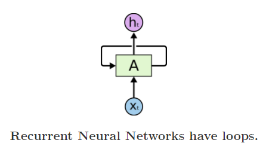

RNN은 재귀를 가짐.

&nbsp;

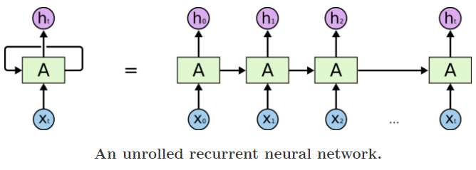

풀어보면 오른쪽과 같은 모양

&nbsp;

NN 중에서 가장 deep 한 구조이다.

1. x ~ h 까지 deep 하다. (세로)
2. 0 ~ t 까지 deep 하다. (가로)

&nbsp;

### vanishing gradient problem (gradient가 사라지는 문제)

-> gradient가 없어지거나(vanishing) 폭발한다(exploding)

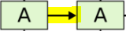

재귀를 할때 재귀를 거듭할 수록 수렴하거나 발산한다.

**if 0.9** : 점점 0에 수렴한다. -> 이전의 값의 영향력이 없다.
**if 1.1** : 점점 발산한다. -> 이전의 값의 영향력이 너무 크다.

&nbsp;
&nbsp;

##LSTM (Long Short-term Memory)

0.9, 1, 1.1 섞자

섞으면 나아지겠지..

그럼 얘를 상수(0.9, 1, 1.1 등)로 주지 말고 control unit을 달자. 조절하는 gate를 달자!

&nbsp;

| RNN | LSTM     |
| :------------- | :------------- |
| 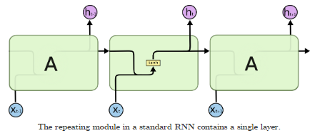    | 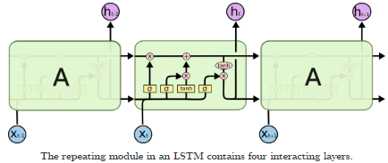  |

LSTM 에는 tanh, relu, sigmoid 등의 단순한 activation function 보다 복잡함.

-> 얘가 옛날 정보를 다음에 넘겨줄지 잊어버릴지 컨트롤하는 역할을 한다. 단순 activation이 아니라 시간적인 흐름을 조절해서 꾸준히 Memory를 유지할지 잊어버릴지를 컨트롤하는 네트워크를 각 A마다 심었다. 라고 이해하시면 됩니다. 더 자세히 이해시켜드릴게요.

**핵심은 Cell**

> 기존 RNN에는 x(input)와 h(hidden layer)가 만나서 activation function을 거쳐서 output으로 나가고 recurrent를 위한 다음 step으로 넘어간다.

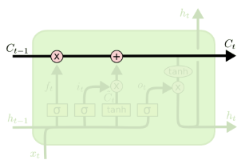

LSTM에는 Cell이라는 것이 있어요.

**C** : 기억/망각 정도를 학습한 Cell

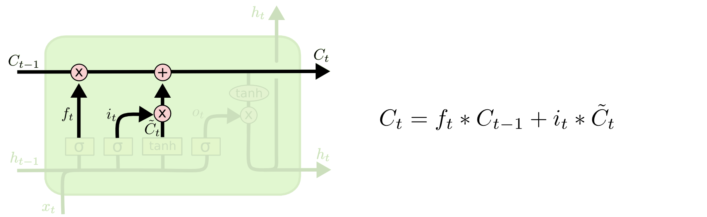

C~t-1~(이전) 와 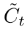(현재) 를 적절히 섞어줄 거에요.

&nbsp;

섞어주는건 누가 결정하느냐?

유닛 안의 network (f~t~, i~t~)가 결정 해 줄 거에요.

이것 역시도 데이터에 의해 학습되는 파라미터구요.

&nbsp;

**Gate : f~t~, i~t~, o~t~**
**Output : h~t~, C~t~**
**parameters : W~f~, W~i~,W~o~,W~h~**

> 모든 Gate는 hidden unit(h~t-1~)과 (x~t~) 를 input을 받아들여서 NN을 거친 후 sigmoid로 0 ~ 1 사이의 결과를 냄
>
> 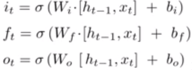

&nbsp;

**forget Gate ( f~t~ )**

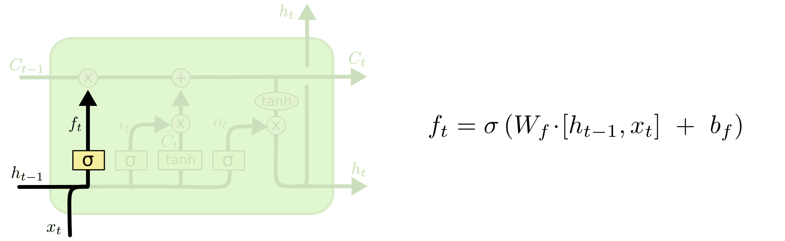

이전의 cell을 얼마나 forget 할지를 결정하구요

(1이면 전체를 기억 / 0이면 모두 forget)

&nbsp;

**input Gate ( i~t~ ) / 현재상태의 Cell ( )**

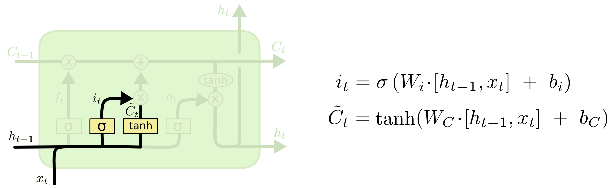

**input Gate** :  를 Cell에 얼마나 반영할 것인가 ?

**** :

&nbsp;

**output Gate**

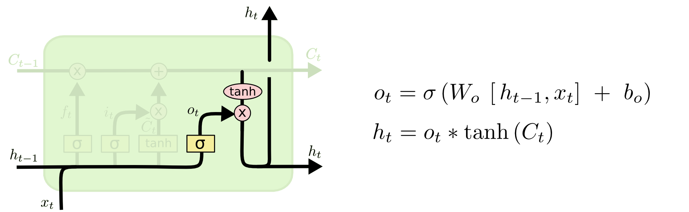

&nbsp;

**h~t~ = o~t~ * tanh (C~t~)**

그냥 **h~t~ = tanh (C~t~)** 로 배출하는 것이 아니라

output 역시도 **o~t~** 를 이용하여 어느정도 배출할지를 조정하는거죠.

**( h~t~ )**
1. 직접적인 output
2. 다음 레이어의 h

&nbsp;

**o~t~ = blah~**

output Gate 는 어떻게 배우겠어요?

똑같죠... x와 h를 받아서 NN 학습하고 0 ~ 1 사이의 값을 내놓는다.

&nbsp;

저는 다이어그램보다 수식을 보는게 더 편하거든요..

**수식** 을 보시면 간단해요

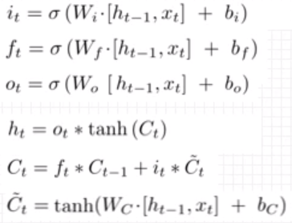

핵심은 Cell.

&nbsp;

Long-term Memory : C~t~

Cell이 이전의 어느정도 잊어버리고 현재의 어느정도 받아들일지를 결정한다

&nbsp;

Short-term Memory : h~t~

현재 Cell 정보를 받아서 h~t~를 만든다

이게 2개의 output 이에요.

&nbsp;

그리고 얘네를 조절하는게 뭐에요?

바로 Gate들인데 이 3개는 x와 h를 받아들여서 배운다.

&nbsp;

그리고 이 모든 과정은 그냥 데이터를 때려넣으면 되는 **end to end** 이다.

기존의 RNN은 W~h~ 파라미터를 가지지만

**LSTM은 RNN보다 4배의 파라미터(W~f~,W~i~,W~o~,W~h~)를 가집니다.**

-> 이는 훨씬더 Long-term Memory를 잘 반영해줍니다.

> 나는 한국사람이야.  
blah~  
blah~   
그래서 나는 한국어를 할 줄 알아.   

**한국어** 라는 단어를 예상하기 위해서는 아주아주 이전에 언급했던 **'나는 한국사람이야'** 가 중요한 키가 될 거잖아요?

근데 **'나는 한국사람이야'가 중요한 정보니까 계속 기억하고 있어야지** 하는게 LSTM의 역할입니다.
